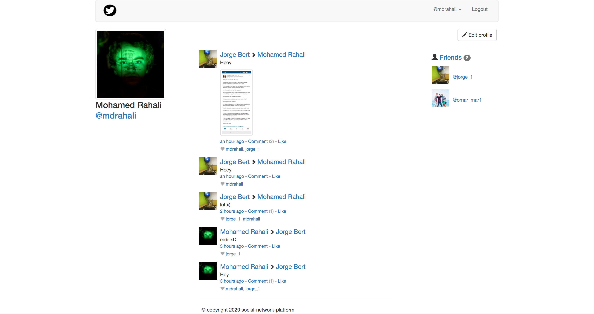

## SOCIAL NETWORK PLATFORM



##### + Features Built-in this social-network platform:
    - Authentification & Authorization
    - Email Registration Confirmation
    - Password Reset Workflow (Change Password & Forgot)
    - Forms Data Validations
    - Account Reconfirmation when Changing Email
    - CRUD Ops on Models(User, Relationship, Feed)
    - Pagination
    - Image Uploads
    - Records Indexation (Faster Response From db)
    - Social Network Standard Features:

        + Post with multiple Images
        + Like
        + Profile
        + Friendship
        + Wall
        + Feed (Fan-out Pattern)

    - 90% Tested Features
    - Mongodb configuration
    - Dockerization (Red Hat Enterprise Linux)
    - Coverage Report
    - Bash Scripts
    - Flask CLI
    - AWS Integration

##### + Later on Features to be add:
    - JWT Access Tokenization (Authorization)
    - Rate Limiting
    - Third-party registration & login
    - Internationalization
    - Migration
    - Admin Panel
    - Real-time chat
    - Push Notification
    - Caching (Redis)
    - UI Automated Testing (Selenium WebDriver)
    - Full EC2 Deployment

##### + run Mongodb From the conf file (mongod.conf):
    - cd social-network-platform
    - mkdir data
    - mkdir log
    - touch mongod.conf
```
    systemLog:
        destination: file
        path: "/Users/MDRAHALI/Desktop/Learning_Roadmap/social-network-platform/log/mongod.log"
        logAppend: true
    storage:
        journal:
            enabled: false
        dbPath: "/Users/MDRAHALI/Desktop/Learning_Roadmap/social-network-platform/data"
    processManagement:
           fork: true
    net:
        bindIp: 0.0.0.0
        port: 27017
```

    - mongod -f mongod.conf


##### + to restart mongodb server:

    - sudo rm /usr/local/var/mongodb/mongod.lock
    - mongod -f mongod.conf
        or use this command
    - chmod -R 755 mongo_restart

##### + if you got this error `` Failed to set up listener: SocketException: Address already in use `` :

    1- sudo lsof -iTCP -sTCP:LISTEN -n -P

    2- sudo kill 37885

    3- mongod -f mongod.conf

##### + Launch The App :
    - export environment='testing'
    => echo $environment # check

    -> python manage.py runserver


##### + database ops:
    1- source ./venv/bin/activate
    2- (venv) MACBOOK-ELRAHALI:social-network-platform mdrahali$ python manage.py shell

##### + running tests:

    -> python tests.py

##### + Mongodb Queries :

    -> db.collection.getIndexes() # find queries
    -> db.users.dropIndex( "userIdx" ) # delete an index by name
    -> db.users.dropIndex( { "username" : -1 } ) # delete an index by key


##### + Indexation Technique:
    # Indexation in mongodb tend to speed-up the read operations from O(n) -> O(1)

    -> db.users.find( { "username" : "mdrahali" } ).explain() # indexed search == we have an index by `username`
    -> db.users.find( "first_name" : "Mohamed" ).explain() # no indexed search

##### + Amazon Configuration:
    # Amazon simple Email Service:
        !- mkdir ~/.aws
        !- vi ~/.aws/credentials
        !- add Secret Keys:
                aws_access_key_id = AKI*******************
                aws_secret_access_key = XMF8v*************
        !- vi ~/.aws/config
                    [default]
                    region = us-west-2


##### + Coverage Testing (delete `venv` virtual-env before executing the command):
    - coverage run --omit /venv/* tests.py
    - coverage report (or coverage html)

##### + Docker Image Deploy:
    - docker build .
    - docker-compose up --build

##### + Docker Commands:
    - docker-compose stop
    - docker-compose ps
    - docker-compose rm -f
    - docker rmi -f $(docker images -qf dangling=true)
    - docker rmi social-network-platform_web --force
    - docker rmi $(docker images --filter dangling=true -q --no-trunc) --force
    - docker kill 29b49da748cf
    - docker system prune
    - docker volume prune

##### + Tech Stack And Tools used to build the app :
    - AMAZON Simple Email Service (Mailing Service)
    - Flask (Web Framework)
    - Mongodb (NoSQL Database)
    - AMAZON S3 (Image Upload)
    - Unittest (Unitesting)
    - Docker (Containers)

##### + CORS configuration editor ARN: arn:aws:s3:::social-network-image-upload

    <?xml version="1.0" encoding="UTF-8"?>
        <CORSConfiguration xmlns="http://s3.amazonaws.com/doc/2006-03-01/">
            <CORSRule>
                <AllowedOrigin>*</AllowedOrigin>
                <AllowedOrigin>http://*</AllowedOrigin>
                <AllowedOrigin>https://*</AllowedOrigin>
                <AllowedMethod>GET</AllowedMethod>
                <MaxAgeSeconds>3000</MaxAgeSeconds>
                <AllowedHeader>Authorization</AllowedHeader>
            </CORSRule>
        </CORSConfiguration>

##### + Install Some Dependencies :
   - [ImageMagick](https://imagemagick.org/script/download.php)

